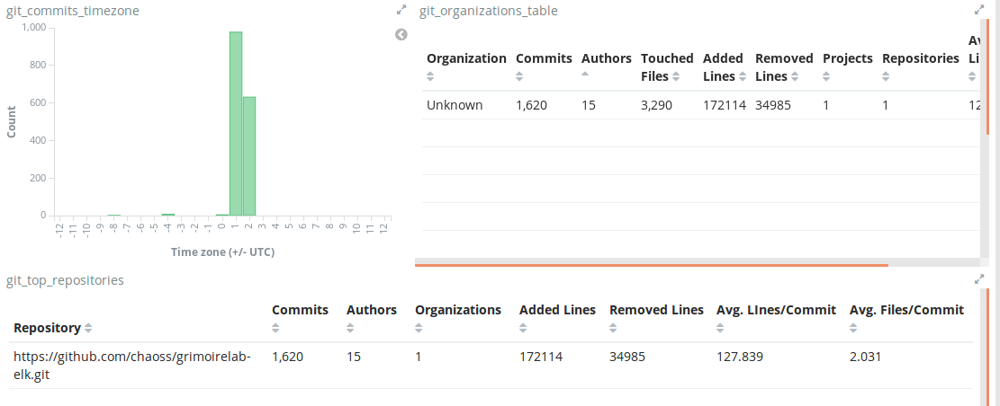
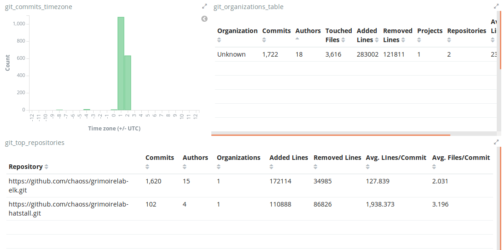
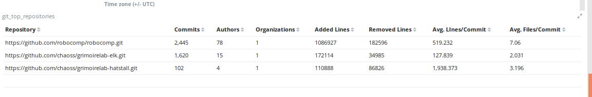
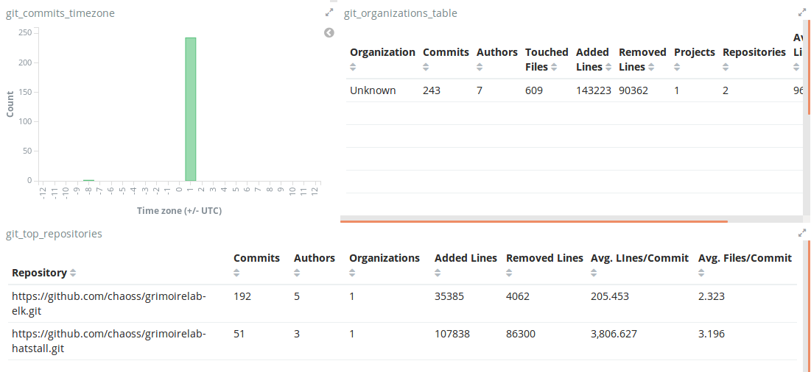
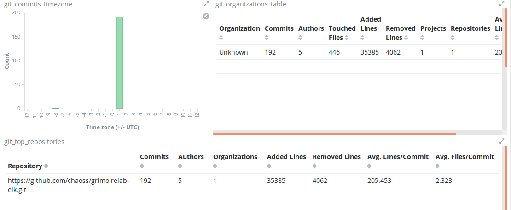

# Chaoss-Microtasks

* **Requirements**
1. development environment, python3, pip3
2. Elasticsearch running on localhost:9200, Kibana running on localhost:5601
3. Grimoirelab packages like sortinghat, perceval  
4. Clone the repository using  
> git clone https://github.com/anveshc05/Chaoss-Microtasks.git

### Micro-task 1

Produce a Python script that produces configuration files for Mordred to analyze a complete GitHub organization, excluding repositories that are forks from other GitHub repositories. Test it with at least two GitHub organizations, producing screenshots of the resulting dashboard.

* **Solution file**  

The python code which generates the configuration files which generate the configuration files for mordred can be found in the [mtask1](mtask1/) directory by the name [mtask1.py](mtask1/mtask1.py).

I have produced dashboards for 2 organizations which are
* [haiku](https://github.com/haiku)
* [robocomp](https://github.com/robocomp)

* **Screenshots**  
All the screenshots have been placed in the [Screenshots](mtask1/Screenshots/) directory inside the [mtask1](mtask1/) directory.

_Some sample screenshots for reference_

* **How To Run**  
* Run command
> python mtask1.py orgname   
* This would lead to formation of 2 files orgname.cfg and orgname.json
* Start elasticearch and kibana.
* Change the name of sorting-hat user, sorting-hat password and [add your github api token](https://help.github.com/articles/creating-a-personal-access-token-for-the-command-line/) to the github backend.
* Run the command 
> mordred -c orgname.cfg
* Run kibana to see dashboards.

### Micro-task 2

Produce a Python script that adds a new GitHub repository (git and GitHub issues / pull requests) to a given set of Mordred configuration files. Test it by adding at least two repositories (in two separate steps) to a GrimoireLab dashboard, producing screenshots of the results.

* **Solution file**  

The python code which generates the configuration files which generate the configuration files for mordred can be found in the [mtask2](mtask2/) directory by the name [mtask2.py](mtask2/mtask2.py).

I have shown the addition of two different repositories to the dashboard, one from the same project and one from another project for showing the working of implementation

* **Screenshots**  
All the screenshots have been placed in the [Screenshots](mtask2/Screenshots/) directory inside the [mtask2](mtask2/) directory.

_Some Sample Screenshots for reference_

* **How To Run**  
* Run command
> python mtask2.py project_name orgname reponame 
* This would lead to formation of 2 files projectname_reponame.cfg and projectname_reponame.json
* Start elasticearch and kibana.
* Change the name of sorting-hat user, sorting-hat password and [add your github api token](https://help.github.com/articles/creating-a-personal-access-token-for-the-command-line/) to the github backend.
* Run the command 
> mordred -c projectname_reponame.cfg
* Run kibana to see dashboards.

### Micro-task 3

Produce a Python script that removes a GitHub repository (git and GitHub issues / pull requests) from a working GrimoireLab dashboard, by modifying the needed Mordred configuration files, and fixing the raw and enriched indexes to remove the items for the removed repository. Test it by removing at least two repositories (in two separate steps) from a GrimoireLab dashboard, producing screenshots of the results.

* **Solution File**

The python code which deletes the repository from a pre-existing kibana dashboard can be found in the [mtask3](mtask3/) directory by the name [mtask3.py](mtask3/mtask3.py).

The two repositories which were added in the Micro-task 2 are shown to be deleted in this microtask in two seperate steps.

* **Screenshots**  
All the screenshots have been placed in the [Screenshots](mtask3/Screenshots/) directory inside the [mtask3](mtask3/) directory.

_Some Sample Screenshots for reference_

* **How To Run**  
* Start elasticearch and kibana.
* Run command
> python mtask3.py 
* This would present to you the repositories present in the dashboard in the github index.
* Select the S.No. of the repository which you want to delete and it will be deleted from the dashboard.
* Run kibana to see dashboards.
