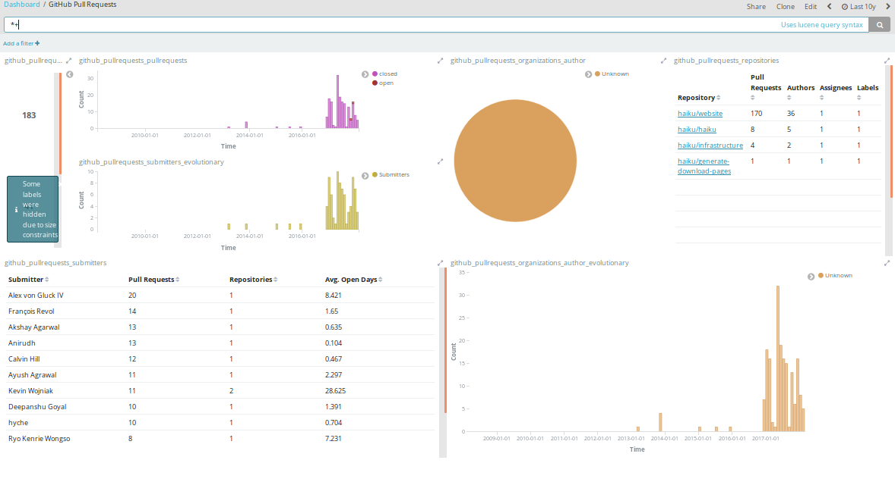

# Chaoss-Microtasks

* **Requirements**
1. development environment, python3, pip3
2. Elasticsearch running on localhost:9200, Kibana running on localhost:5601
3. Grimoirelab packages like sortinghat, perceval  

### Micro-task 1

Produce a Python script that produces configuration files for Mordred to analyze a complete GitHub organization, excluding repositories that are forks from other GitHub repositories. Test it with at least two GitHub organizations, producing screenshots of the resulting dashboard.

* **Solution file**  

The python code which generates the configuration files which generate the configuration files for mordred can be found in the [mtask1](mtask1/) directory by the name [mtask1.py](mtask1/mtask1.py).

I have produced dashboards for 2 repositories which are
* [haiku](https://github.com/haiku)
* [robocomp](https://github.com/robocomp)

* **Screenshots**  
All the screenshots have been placed in the [Screenshots](https://github.com/anveshc05/Chaoss-Microtasks/tree/master/mtask1/Screenshots/) directory inside the [mtask1](https://github.com/anveshc05/Chaoss-Microtasks/tree/master/mtask1/) directory.

_Some sample screenshots for reference_

* **How To Run**  
* Clone the repository using
> git clone https://github.com/anveshc05/Chaoss-Microtasks.git
* Run command
> python mtask1.py <orgname>   
* This would lead to formation of 2 files <orgname>.cfg and <orgname>.json
* Start elasticearch and kibana.
* Change the name of sorting-hat user, sorting-hat password and [add your github api token](https://help.github.com/articles/creating-a-personal-access-token-for-the-command-line/) to the github backend.
* Run the command 
> mordred -c <orgname>.cfg
* Run kibana to see dashboards.

